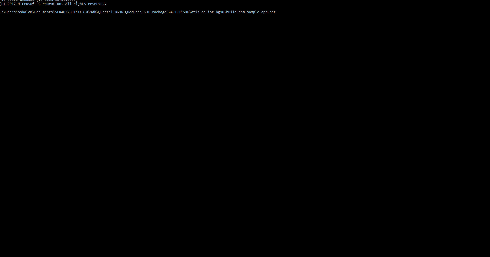

# Installing the OS-IoT Library for C

## Instructions

In a seperate folder, clone the github repo

```sh
git clone https://atis.codebasehq.com/atis-os-iot/atis-os-iot-bg96.git
```


Once you have cloned the repo, open up the `build_dam_sample_app.bat` file

with the following contents: 

```sh
set LLVM_ROOT_PATH=C:\quecteldev\llvm
set TOOLCHAIN_PATH=%LLVM_ROOT_PATH%\bin
set TOOLCHAIN_PATH_STANDARDS=%LLVM_ROOT_PATH%\armv7m-none-eabi\libc\include
set LLVMLIB=%LLVM_ROOT_PATH%\lib\clang\4.0.3\lib
set LLVMLINK_PATH=%LLVM_ROOT_PATH%\tools\bin
set DAM_ELF_OUTPUT_PATH=bin
set DAM_INC_BASE=..\..\include
set DAM_LIB_PATH=..\..\libs
set DAM_SRC_PATH=src
set DEMO_APP_SRC_PATH=src\demo
set PYTHON_PATH=F:\Python27\python.exe
set QFLOG_PATH=C:\quecteldev\qcomtools\QFLOG\src\QFLOGPackage\QFLOG.py
set COM_PORT=COM13
```


The `LLVM_ROOT_PATH` will need to point to the correct path to your LLVM folder. This folder can be obtained by Quectel SDK

The `TOOLCHAIN_PATH` will contain the bin files neccessary for compiling the C code (Please make sure this path is correct as your root LLVM folder might have a version folder that would need to be taken into considertions)

The `DAM_INC_BASE` and `DAM_LIB_PATH` are paths to the actual C code provided by Quectel once the SDK is obtained

The `PYTHON_PATH` is neccesary for logging output on the BG96, we recommend using Python 2.7

The `QFLOG_PATH` is obtained by the Quectel SDK as well


## Example output

Once you have the enviorment vars taken care of, here is an example output of what the `build_dam_sample_app.bat` should return

